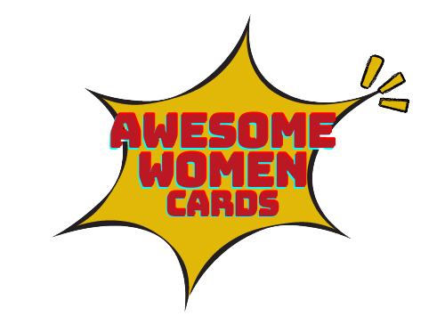

# Proyecto grupal Awesome Women Cards heredado

## Autoras

- Lara R. Poblet - [@lrpoblet](https://github.com/lrpoblet)
- Laura García - [@Garcia-Laura](https://github.com/Garcia-Laura)
- Marta Castrillo - [@martcastrillo](https://github.com/martcastrillo)
- Sara Meixoeiro - [@Sameidu](https://github.com/Sameidu)
- Virginia Álvarez - [@Virginia-Alvarez](https://github.com/Virginia-Alvarez)

## Resumen

Se trata de una aplicación web que permite crear una tarjeta de visita personalizada. En la página web podemos introducir nuestros datos profesionales y obtener una vista maquetada con esta información.

La aplicación funciona siguiendo estos pasos:

1. Permitir al usuario elegir el estilo de la tarjeta, eligiendo paleta de colores
2. Permitir al usuario que, mediante la introducción de información en un formulario, este texto se muestre maquetado automáticamente en un cuadro similar a una tarjeta de visita, que será la muestra del resultado final
3. Permitir que el usuario pueda crear una web con su tarjeta y compartirla por Twitter

## Particularidades

En este proyecto se ha trabajado con código heredado, es decir, escrito por otras personas y sobre el que hemos tenido que trabajar. Además se ha desarrollado la parte back, creando una base de datos y servidor propios. Por tanto, se trata del desarrollo de un producto completo: **front end + back end**.

## Proyecto original

El proyecto consta de 2 páginas:

- Una página landing de bienvenida
- Una página con la aplicación de crear tarjetas

En el desarrollo de esta aplicación web se han usado las siguientes tecnologías:

- Uso avanzado de formularios **HTML**
- Maquetación usando **CSS avanzado**, como flex y grid
- Uso de **mediaqueries** para que el diseño sea adaptable al dispositivo usando la estrategia **mobile first**
- Uso de **JavaScript**
- Gestión de **eventos en el navegador**
- Acceso y envío de datos a un **servidor**
- Almacenamiento en local usando **LocalStorage**
- Uso de **git** para el control de versiones del proyecto
- Publicación del resultado en Internet usando **GitHub Pages**

## Aportaciones

Se ha refactorizado el proyecto utilizando las siguientes tecnologías:

- Uso de **React** para la estructuración del JS de la aplicación
- Implementación de una navegación entre distintas páginas de la aplicación usando **React router**.
- Trabajo con **Node Js** y **Express JS** para escuchar peticiones desde los navegadores.
- Creación de tablas en base de datos **SQLite**.
- Estructuración y organización de las comunicaciones entre un navegador y un servidor medante **API Rest**.

## Otros enlaces de interés

- Proyecto original: http://beta.adalab.es/project-promo-r-module-2-team-6/
